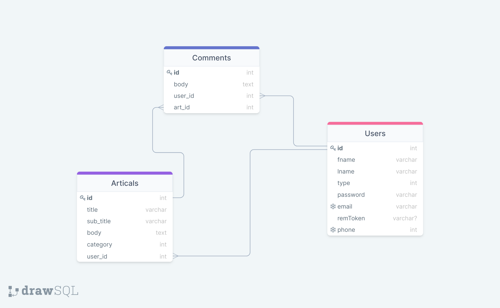
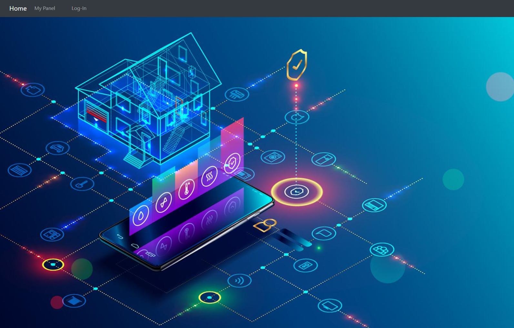
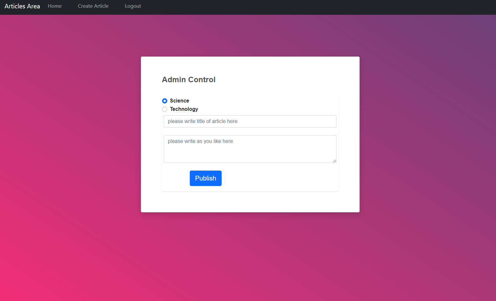
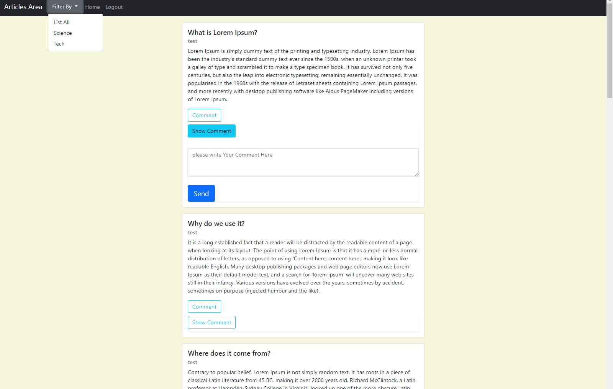

## How Install Blog System 
 <ul>
 <li> git clone https://github.com/ibrahimahmed1998/Blog-Demo </li>
 <li> open downloaded files with vscode terminal  </li>
 <li> open terminal and run command  :<b  composer install</b>  </li>
 <li> in .env file configre database variables   </li>
 <li> run command :<b > php artisan migrate</b>  </li>
    <li>  run command : <b >php artisan serve</b>   </li>
    <li> You can use <b>Root User</b> " as Admin " -> E-mail= hema.1998.man@gmail.com && Password = 12345678 OR Add User To System As Visitor Type </li>
 </ul>
           
## Compeleted
 
 
 
 
